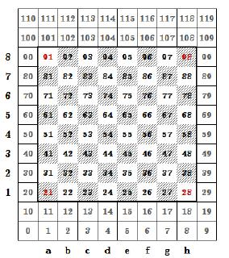

# Jomini_chess_engine

PREFACE :-

		When i was doing my TIC_TAC_TOE project, i used MIN-MAX algorithm to give game artificial intelligence. From then i got fascinated and decided to work more on AI

		(Power of memory to calculate something (i say it -power to predict something)), and selected this project to work on.

	

ABOUT PROJECT :-

					I have worked on this project into different parts, these are as following :-

					PART-1) BOUNDARY and BIT-BOARD :- unsigned Long long(64 bit) data type is used to represent Bit-Board (8*8 = 64 squares).

								a) INITIALIZATION :- Pieces, boundary is initialized. Chess consistes two parts :- 

													i) 120 indexed board (For Computer):- The whole borad including boundary (Board for computer, on which it works its 																							
																							evaluation).

													ii) 64 indexed board (For Human):- The playable board on which moves will take place(Board for outside world, that 

																						will be shown). co- ordinates are named RANK and FILE.  

   
								b) PRINT BOARD :- 64 indexed based board will be shown to the player.

								c) Hash key or Position key: in this part , from given situation a unique has key is generated. 

								d) FEN notation: a unique notation for chess board which talks with GUI(arena) using UCI protocol.
									
													e.g.: rnbqkbnr/pppppppp/8/8/8/8/PPPPPPPP/RNBQKBNR w KQkq - 0 1
										
												a) parsing is done for given string and set all variables of board for that string

												b) printing board for the given FEN notation 

												NOTE :-> before FEN notation all variable has been reset to default initial value
													

 

				    
